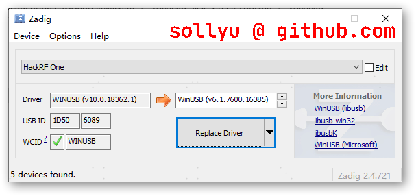

# hackrf one gps

## 驱动

驱动文件存放于`build/tools/zadig-2.4.exe`双击运行后选择好设备即可安装。



## 异常1

问题：运行过程中出现下面错误

```
Exception in thread "main" java.net.UnknownHostException: cddis.gsfc.nasa.gov
        at java.net.Inet6AddressImpl.lookupAllHostAddr(Native Method)
        at java.net.InetAddress$2.lookupAllHostAddr(InetAddress.java:929)
        at java.net.InetAddress.getAddressesFromNameService(InetAddress.java:1324)
        at java.net.InetAddress.getAllByName0(InetAddress.java:1277)
        at java.net.InetAddress.getAllByName(InetAddress.java:1193)
        at java.net.InetAddress.getAllByName(InetAddress.java:1127)
        at java.net.InetAddress.getByName(InetAddress.java:1077)
        at org.apache.commons.net.SocketClient.connect(SocketClient.java:202)
        at cn.uvghoj.oljw.oced.Application.main(Application.kt:67)
        at cn.uvghoj.oljw.Main.main(Main.kt:8)
```

回答：这是访问国外数据文件失败，请确定当前的网络可以正常访问国外网址。

## 异常2

问题：在最后发送信号时出现下面错误：

```
call hackrf_set_sample_rate(2600000 Hz/2.600 MHz)
call hackrf_set_hw_sync_mode(0)
hackrf_set_hw_sync_mode() failed: feature not supported by installed firmware (-1005)
```

回答：这是因为您的板子的固件版本太低了，刷入一个新的固件就可以了，可参考一下[这篇文章](https://github.com/mossmann/hackrf/releases)。