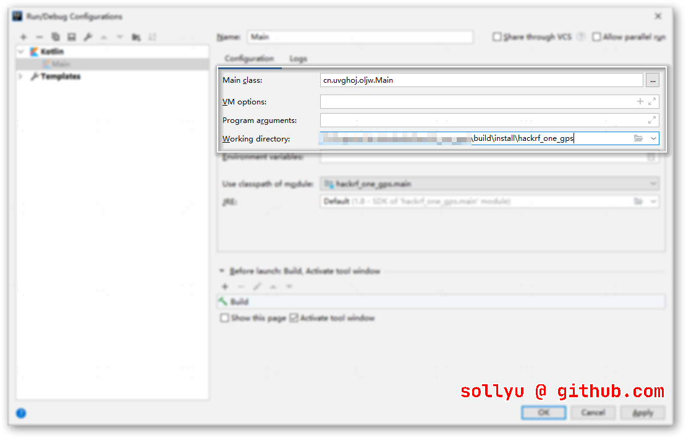

# hackrf one gps

## 说明

这个工程是一个方便Windows用户在使用hackrf one模拟GPS信号时的各种麻烦的操作。

项目是一个标准的gradle kotlin工程，可直接使用`gradlew build`构建项目和导入到IntelliJ IDEA中。

> `gradle build`项目构建完成，文件存放于：`build/distributions`文件夹中

## 预览


## 调试

调试前先执行`gradlew clean installDist`然后将IntelliJ IDEA运行目录中设置为：

```
build/install/hackrf_one_gps
```



## 其他

在使用`gradle build`构建时请确保正确的设置`JAVA_HOME`路径，如本开发者配置如下：

```
D:>echo %JAVA_HOME%
C:\Program Files\Java\jdk1.8.0_211


D:>dir "C:\Program Files\Java\jdk1.8.0_211"
2020/03/24  10:15    <DIR>          bin
2019/04/01  21:41             3,244 COPYRIGHT
2020/03/24  10:15    <DIR>          include
2020/03/24  10:15         5,213,269 javafx-src.zip
2020/03/24  10:15    <DIR>          jre	<=================== 请确保此文件夹存在
2020/03/24  10:15    <DIR>          lib
2020/03/24  10:15                44 LICENSE
2020/03/24  10:15               159 README.html
2020/03/24  10:15               426 release
2019/04/01  21:41        21,248,779 src.zip
2020/03/24  10:15           112,748 THIRDPARTYLICENSEREADME-JAVAFX.txt
2020/03/24  10:15           149,725 THIRDPARTYLICENSEREADME.txt
               8 个文件     26,728,394 字节
               6 个目录 34,994,147,328 可用字节
```

